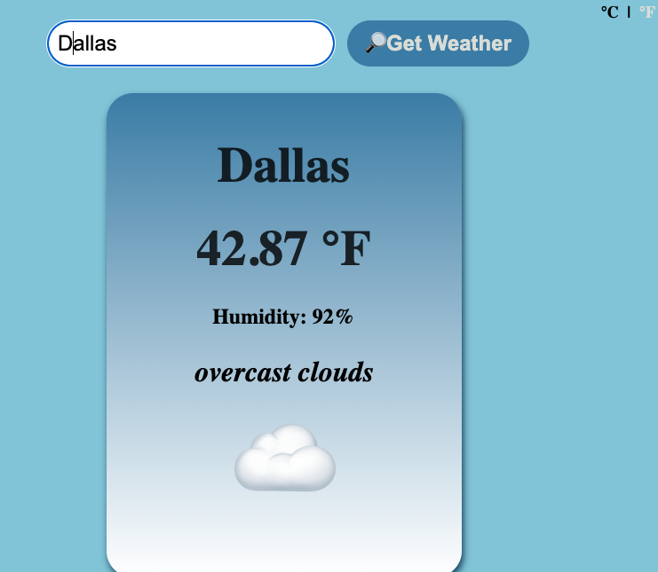

# Meteo-API-project
The app is built with HTML, CSS, and JavaScript, making use of async/await for seamless API integration.

A simple and interactive weather forecast application that fetches real-time weather data using the OpenWeather API. Users can enter any city to get the current temperature, humidity, and weather conditions, along with an appropriate weather emoji. The app allows users to switch between Celsius and Fahrenheit for temperature display. 

